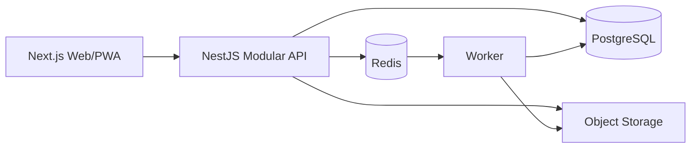

# Diseño: Fundación de plataforma

## Arquitectura

## Módulos iniciales

`Identity`, `Organizations`, `Projects`, `Measurements`, `Images`, `Colors`, `Calculations`, `Catalog`, `Inventory`, `Pricing`, `Quotes`, `Orders`, `Suppliers`, `Audit`.

## Estrategia de datos

PostgreSQL es la fuente de verdad. JSON se usa únicamente para snapshots, geometrías, metadatos o payloads de integración; no sustituye relaciones esenciales.

## Observabilidad

Cada solicitud tendrá correlation id. Los procesos asíncronos registrarán estado, reintentos y error final. En producción se incorporarán OpenTelemetry, métricas y Sentry.

## Seguridad

OIDC, autorización multi-tenant, validación de archivos, URLs firmadas, secretos externos, auditoría y backups restaurables.
