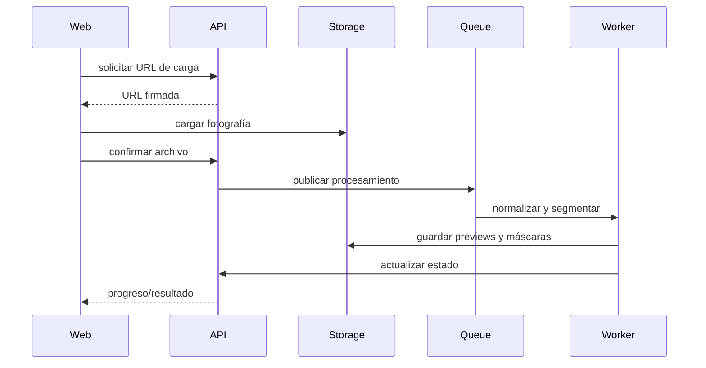

# Diseño: Visualizador fotográfico

## Flujo

## Primera entrega

Selección manual o semiautomática con máscara editable. La segmentación avanzada no bloquea el MVP.

## Render

Convertir color objetivo a un espacio perceptual y combinarlo con luminancia/textura de la superficie original. Mantener parámetros versionados.

## Privacidad

No usar fotografías para entrenamiento sin consentimiento específico. Definir retención, eliminación y exportación.
