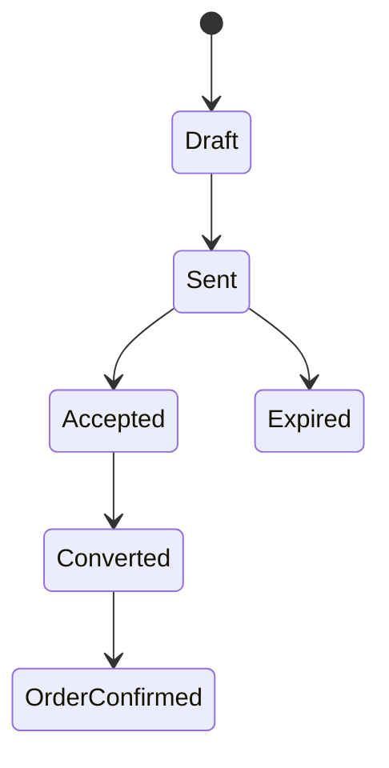

# Diseño: Inventario, cotización y pedido

## Consistencia

PostgreSQL conserva saldos internos y reservas. Integraciones externas actualizan mediante adaptadores idempotentes. El stock visible puede usar cache breve, pero la confirmación siempre consulta la fuente de verdad.

## Snapshot de cotización

Cada versión guarda:

- inputs y resultados del cálculo;
- SKU, nombre, presentación y ficha técnica;
- fórmula de color y base;
- cantidad, precio, impuestos y descuentos;
- sucursal, stock observado y timestamp;
- sustituciones aceptadas;
- condiciones y vigencia.

## Conversión

## Integraciones

Adaptadores para ERP/POS/proveedor detrás de interfaces. Registrar request, response normalizada, reintentos y error final sin exponer secretos.
