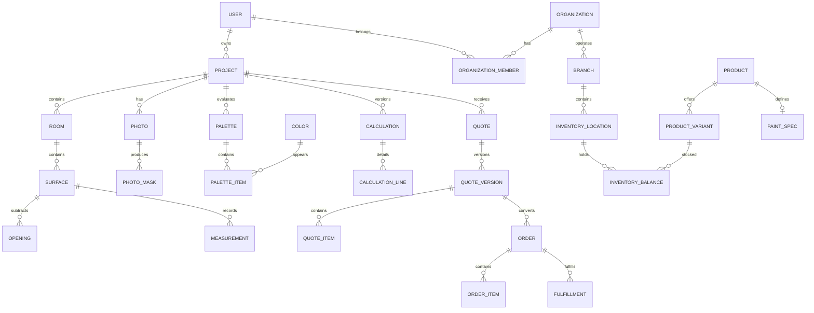

# Esquema relacional simplificado

```mermaid
erDiagram
  USER ||--o{ PROJECT : owns
  USER ||--o{ ORGANIZATION_MEMBER : belongs
  ORGANIZATION ||--o{ ORGANIZATION_MEMBER : has
  ORGANIZATION ||--o{ BRANCH : operates
  PROJECT ||--o{ ROOM : contains
  ROOM ||--o{ SURFACE : contains
  SURFACE ||--o{ OPENING : subtracts
  SURFACE ||--o{ MEASUREMENT : records
  PROJECT ||--o{ PHOTO : has
  PHOTO ||--o{ PHOTO_MASK : produces
  PROJECT ||--o{ PALETTE : evaluates
  PALETTE ||--o{ PALETTE_ITEM : contains
  COLOR ||--o{ PALETTE_ITEM : appears
  PRODUCT ||--o{ PRODUCT_VARIANT : offers
  PRODUCT ||--o| PAINT_SPEC : defines
  PRODUCT_VARIANT ||--o{ INVENTORY_BALANCE : stocked
  BRANCH ||--o{ INVENTORY_LOCATION : contains
  INVENTORY_LOCATION ||--o{ INVENTORY_BALANCE : holds
  PROJECT ||--o{ CALCULATION : versions
  CALCULATION ||--o{ CALCULATION_LINE : details
  PROJECT ||--o{ QUOTE : receives
  QUOTE ||--o{ QUOTE_VERSION : versions
  QUOTE_VERSION ||--o{ QUOTE_ITEM : contains
  QUOTE_VERSION ||--o{ ORDER : converts
  ORDER ||--o{ ORDER_ITEM : contains
  ORDER ||--o{ FULFILLMENT : fulfills
```

El esquema ejecutable está en `apps/api/prisma/schema.prisma`.
